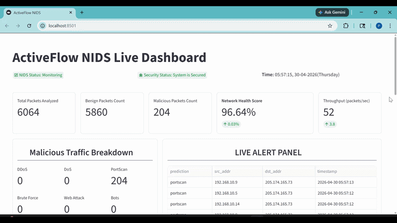
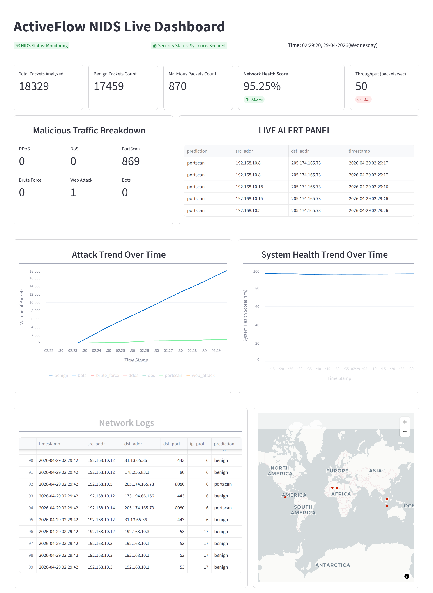

<div align="center">

# ActiveFlow NIDS

### ML-based End-to-End Real-Time Network Intrusion Detection System


A production-grade, end-to-end pipeline that ingests live network flows, classifies them into 7 attack categories in real time using a trained XGBoost model, and visualizes threats on a live Streamlit dashboard — including geolocation mapping, attack trend charts, and a live alert panel.

</div>

---

## Important Notes

**Please read before exploring the project.**

**1. Simulation-based environment:** Due to fundamental incompatibilities between existing flow extraction tools (CICFlowMeter, PyFlowMeter) and production-grade mathematical correctness, live packet sniffing is currently not supported. ActiveFlow operates in a simulated real-time environment by replaying pre-processed LycoS-IDS2017 flows. A new, corrected Python-based flow extraction tool is under active development and will be integrated into the inference pipeline once complete. See [`docs/Research and Outcomes/RCA.md`](./docs/Research%20and%20Outcomes/RCA.md) for full details.

**2. Active development:** v2.0.0 is a stable release but is not yet production-deployment ready. ActiveFlow is under continuous development - new features, optimizations, and architectural improvements are planned for every upcoming version with the long-term goal of building a production-grade NIDS.

**3. Documentation:** This README presents a high-level overview of the architecture, challenges, and limitations. For detailed technical documentation, design decisions, and the full root cause analysis, refer to the **[`docs`](./docs) folder** *(recommended)*.

**4. Deployment:** Deployment and detailed documentation work is under progress and is expected to completed within upcoming days.  

---



> **Note:** The flickering observed in the GIF is due to fast-forwarding during video editing.

For a complete demonstration of ActiveFlow NIDS including system initialization, real-time packet processing, and attack detection, please watch the full video: [Watch Full Demo](https://drive.google.com/file/d/1GWsy5XaC6BbcAw1dAlxZe_rpJutY0UsU/view?usp=sharing)



---

## What It Does

- **Ingests network flows** from a simulation engine replaying LycoS-IDS2017 PCAP-derived CSV files at ~1000 flows/sec
- **Classifies each flow** into one of 7 categories - Benign, DoS, DDoS, PortScan, Brute Force, Web Attack, Bots — in under 1ms per prediction via an async FastAPI inference server
- **Streams predictions** to a real-time Streamlit dashboard with threat counts, network health score, attack trend charts, system health trend, live alert panel, and IP geolocation map
- **Trained on LycoS-IDS2017** - a peer-reviewed, corrected dataset that fixes documented labeling errors, duplicate flows, and miscalculated TCP features present in the original CIC-IDS2017 benchmark
- **Tracks experiments** with MLflow and DagsHub - full training run history, hyperparameter logs, and model metrics are versioned and reproducible

---

## Architecture

.png)

For a detailed architecture of the Inference Pipeline and Training Pipeline, please refer to [`docs/Architecture`](./docs/Architecture/).

---

## Model Performance

Trained on **1.8M real network flows** across 7 attack classes. The migration to LycoS-IDS2017 eliminated the train-serve skew that caused the previous model (trained on the CIC-IDS2017 dataset) to predict BENIGN on confirmed DDoS and PortScan flows.

| Metric | CIC-IDS2017 (Previous) | LycoS-IDS2017 (Current) |
|--------|:----------------:|:------------------:|
| F1 Score (Test) | 0.9402 | **0.9999 (Weighted)** |
| Weighted Precision | 0.9029 | **0.9999 (Weighted)** |
| Recall | 0.9990 | **0.9999** |
| False Positive Rate | — | **0.000069** |
| Train/Test Gap | 0.0596 | **~0.0000** |
| Training Time | 3h 10m | **49 min** |
| Best Model | LightGBM | **XGBoost** |

> **On FPR:** A False Positive Rate of 0.000069 means the system raises a false alarm on approximately 1 in 14,000 benign flows, the operationally critical metric for any production IDS.

**For detailed information on how the model was trained and how it performed on different datasets, please refer to:**

- [`Log File — Training Pipeline on CIC-IDS2017 Dataset`](./logs/04_11_2026_06_31_44.log)
- [`Log File — Training Pipeline on LycoS-IDS2017 Dataset`](./logs/04_16_2026_19_33_32.log)

<br>

### Per-Class Detection

| Attack Class | Recall |
|---|:---:|
| Benign | 0.9999 |
| DDoS | 1.0000 |
| PortScan | 0.9999 |
| DoS Hulk | 0.9999 |
| Brute Force | 1.0000 |
| Web Attack | 1.0000 |
| Bots | 1.0000 |

---

## Tech Stack

| Layer | Tools |
|---|---|
| ML Pipeline | scikit-learn, XGBoost, LightGBM, imbalanced-learn |
| Sampling | RandomUnderSampler + SMOTETomek (hybrid) |
| Important Libraries | Evidently, GeoIP2 |
| Experiment Tracking | MLflow, DagsHub |
| Inference API | FastAPI, Uvicorn |
| Dashboard | Streamlit, Altair, Plotly |
| Data Versioning | DVC |
| Dataset | LycoS-IDS2017 (corrected CIC-IDS2017), previously Original CIC-IDS2017 |
| Language | Python 3.12 |

---

## Project Structure

```
ActiveFlow-NIDS/
│
├── Artifacts/                          # Auto-generated pipeline run artifacts (gitignored)
│   ├── data_ingestion/
│   │   ├── feature_store/              # Master dataset CSV
│   │   └── ingested/                   # Train and test splits
│   ├── data_transformation/
│   │   ├── transformed_object/
│   │   │   └── preprocessor.pkl        # Serialized sklearn preprocessing pipeline
│   │   └── transformed/                # Transformed train and test numpy arrays
│   ├── data_validation/
│   │   └── drift_report/
│   │       └── report.yaml             # Evidently data drift report
│   └── model_trainer/
│       └── trained_model/
│           └── model.pkl               # Trained model artifact
│
├── data_schema/
│   ├── schema.yaml                     # Column names and dtypes for validation
│   └── top_features.yaml              # Top 28 selected features with dtypes
│
├── docs/                               # All detailed documentation (recommended read)
│   ├── assets/                         # Screenshots and architecture diagrams
│   ├── Architecture/                   # Detailed pipeline architecture diagrams
│   ├── Research and Outcomes/
│   │   └── RCA.md                      # Full root cause analysis with academic citations
│   ├── Challenges_Faced_and_Solutions.md
│   ├── Future_Updates.md
│   ├── Key_Engineering_Decisions.md
│   └── Limitations.md
│
├── EDA/
│   └── EDA.ipynb                       # Exploratory data analysis - feature selection and class distribution
│
├── final_model/                        # Production model artifacts loaded by inference API
│   ├── model.pkl                       # Trained XGBoost classifier
│   └── preprocessor.pkl               # Trained sklearn preprocessing pipeline
│
├── IDS_Pipeline/                       # Full ML training pipeline
│   ├── components/
│   │   ├── data_ingestion.py           # MD5 integrity check, zip extraction, temporal train/test split
│   │   ├── data_transformation.py      # Custom sklearn transformers, hybrid sampling, feature scaling
│   │   ├── data_validation.py          # Schema validation, Evidently drift detection
│   │   └── model_trainer.py            # Hyperparameter tuning, MLflow + DagsHub experiment tracking
│   ├── constant/                       # All pipeline constants, label mappings, config values
│   ├── entity/
│   │   ├── artifact_entity.py          # Dataclasses defining pipeline artifact outputs
│   │   └── config_entity.py            # Dataclasses defining pipeline configuration
│   ├── exception/
│   │   └── exception.py               # Custom exception class with traceback detail
│   ├── logging/
│   │   └── logger.py                  # Centralized logger - all pipeline stages log here
│   ├── pipeline/
│   │   └── training_pipeline.py       # Orchestrates all training stages end to end
│   └── utils/
│       ├── main_utils/
│       │   └── utils.py               # Shared utilities like save/load objects, read YAML
│       └── ml_utils/
│           ├── metric/
│           │   └── classification_metric.py   # F1, precision, recall, FPR calculation
│           └── model/
│               └── estimator.py       # NetworkModel - wraps preprocessor and model together
│
├── Inference_Pipeline/                # Real-time inference and dashboard
│   ├── inference_api.py               # FastAPI server - receives flows, runs predictions, serves metrics
│   ├── simulation_engine.py           # Replays LycoS-IDS2017 flows to inference API at ~1000/sec
│   ├── dashboard.py                   # Streamlit live dashboard (auto-refreshes every second)
│   └── simulation_file/               # LycoS-IDS2017 CSV files (pulled via DVC)
│
├── scrapped_code/                     # LycoSTand source - kept as reference for future tool development
├── raw_data/                          # Raw zipped dataset (tracked via DVC)
├── logs/                              # Training pipeline log files
├── requirements.txt
└── setup.py
```

---

## How to Run

### Step 1 - Clone the Repository

```bash
git clone https://github.com/Priyanshuc26/ActiveFlow-NIDS.git
cd ActiveFlow-NIDS
```

### Step 2 - Create a Virtual Environment (Recommended)

```bash
python -m venv venv

# On Windows
venv\Scripts\activate

# On macOS / Linux
source venv/bin/activate
```

### Step 3 - Install Dependencies

```bash
pip install -r requirements.txt
```

### Step 4 - Pull Simulation Data via DVC

The LycoS-IDS2017 simulation CSV files are version-controlled using DVC and are not stored directly in the repository. Pull them using:

```bash
dvc pull
```

> Ensure you have access to the configured DVC remote before running this command.

### Step 5 - Set Up MaxMind GeoIP2 Database

The dashboard uses the MaxMind GeoIP2 City database for IP geolocation mapping. Without this file, the dashboard will raise an error on startup.

1. Create a free account at [https://www.maxmind.com](https://www.maxmind.com)
2. Download the **GeoLite2-City.mmdb** database file
3. Place it in the project root or update the path in `dashboard.py` to point to the downloaded `.mmdb` file

### Step 6 - Start the Inference API

```bash
python Inference_Pipeline/inference_api.py
```

Server starts at `http://0.0.0.0:8000`. Visit `http://127.0.0.1:8000` to verify

### Step 7 - Start the Simulation Engine

```bash
# In a new terminal
python Inference_Pipeline/simulation_engine.py
```

This replays LycoS-IDS2017 flows to the inference API at ~1000 flows/sec.

### Step 8 - Open the Dashboard

```bash
# In a new terminal
streamlit run Inference_Pipeline/dashboard.py
```

Visit `http://localhost:8501` - the dashboard auto-refreshes every second.

<br>

### API Endpoints

| Endpoint | Method | Description |
|---|---|---|
| `/` | GET | Health check |
| `/predict` | POST | Classify a single network flow |
| `/metrics` | GET | Live traffic buffer + prediction counts |

---

## Documentation

The main README contains a higher-level overview to keep it clean and easily readable. Detailed documentation can be accessed in the **[`/docs`](./docs) folder**.

<br>

**Challenges Faced and Solutions**
- All challenges encountered during development and their corresponding solutions are documented in the [`Challenges Faced and Solutions`](./docs/Challenges_Faced_and_Solutions.md) file.

**Key Engineering Decisions**
- Important decisions taken to improve the performance, stability, and robustness of the system are documented in the [`Key Engineering Decisions`](./docs/Key_Engineering_Decisions.md) file.

**Known Limitations**
- All current limitations are listed in the [`Limitations`](./docs/Limitations.md) file.

**Upcoming Updates**
- The full roadmap of planned major and minor updates can be found in the [`Future Updates`](./docs/Future_Updates.md) file.

---

## Root Cause Analysis

During live deployment, the previous model predicted BENIGN on 100% of flows, including confirmed DDoS traffic generating 45M bytes/sec. The root cause was a **train-serve skew** between CICFlowMeter (Java, used for training data) and PyFlowMeter (Python, used for inference), two tools that compute the same feature names using fundamentally different underlying mathematics.

Further research revealed that the original CIC-IDS2017 dataset has documented labeling errors of up to 75% for some attack classes. The architecture was subsequently migrated to LycoS-IDS2017, a peer-reviewed corrected dataset, eliminating the skew and reducing the train/test gap from 0.0596 to ~0.0000.

<br>

### Why LycoSTand Is Not Currently Used for Live Inference

LycoSTand the C-based tool used to generate the LycoS-IDS2017 dataset was the natural candidate for live flow extraction, as it would guarantee that training and inference features are computed using identical mathematics. However, integrating it proved to be one of the most challenging and time-consuming aspects of this project.

LycoSTand relies on legacy Linux IPC mechanisms, specifically System V semaphores, and was originally validated on Ubuntu 18.04. Every attempt to run it on modern systems failed with semaphore initialization errors (`errno 1`), indicating a fundamental incompatibility with modern Linux kernel security and IPC handling.

The following approaches were attempted exhaustively over two days:

- **Windows terminal** - failed at the initial compilation stage
- **WSL (Windows Subsystem for Linux)** - failed with the same semaphore errors
- **Virtual machine (Ubuntu, multiple versions)** - an entire day was spent reinstalling Ubuntu multiple times across different distributions, adjusting kernel parameters, tuning shared memory settings, and escalating permissions. The tool compiled but consistently failed at runtime
- **Native Ubuntu dual-boot** - as a final attempt, a full dual-boot setup was configured from scratch for the first time, including manual disk partitioning and disabling secure boot. Despite this, the semaphore initialization errors persisted across every configuration attempted

After exhausting every known workaround - dependency reinstallation, kernel parameter tuning, shared memory inspection, permission escalation, and capability adjustments, the conclusion was that the tool's design assumptions are fundamentally incompatible with modern Linux environments. This was later confirmed by the original research paper, which states that LycoSTand was built and validated specifically on Ubuntu 18.04.

This experience directly motivated the planned development of  a new open-source Python-based flow extraction tool that reimplements LycoSTand's corrected mathematical formulations with real-time streaming capability. Once complete, it will connect directly to the inference API without requiring any changes to the rest of the pipeline.

---

## References

1. Lanvin et al. - *Errors in the CICIDS2017 dataset and the significant differences in detection performances it makes* (2022)
2. Engelen et al. - *Troubleshooting an Intrusion Detection Dataset: the CICIDS2017 Case Study* (2021)
3. Lui et al. - *Error Prevalence in NIDS datasets: A Case Study on CIC-IDS-2017 and CSE-CIC-IDS-2018* (2022)
4. D'hooge et al. - *Discovering non-metadata contaminant features in intrusion detection datasets* (2021)
5. [LycoS-IDS2017 Official Repository](https://lycos-ids.univ-lemans.fr/)
6. [LycoSTand: A New Feature Extraction Tool - SciTePress](https://www.scitepress.org/Papers/2022/107740/pdf/index.html)
7. [Network Intrusion Analysis at Scale - InfoSec Writeups](https://infosecwriteups.com/network-intrusion-analysis-at-scale-733169fc29ff)
8. [CIC-IDS2017 Original Dataset - University of New Brunswick](https://www.unb.ca/cic/)
9. [Anatomy of a Flawed Dataset - HAL Science](https://hal.science/hal-03775466v1/document)
10. [Evaluation of CIC-IDS2017 - IEEE](https://ieeexplore.ieee.org/document/9474286)
11. [Dataset Reliability Analysis - IEEE](https://ieeexplore.ieee.org/abstract/document/9947235)

---

## License

Licensed under the [Apache License 2.0](LICENSE).

---

<div align="center">

Built with obsession by [Priyanshuc26](https://github.com/Priyanshuc26)

*"Sometimes the wall is where the real work begins."*

</div>