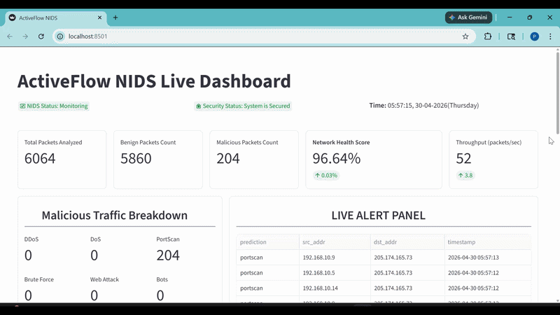
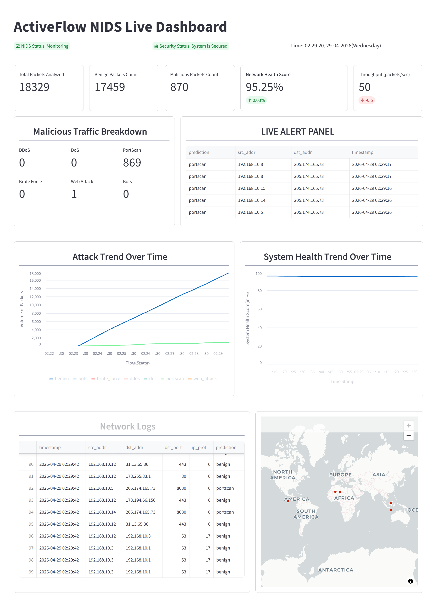
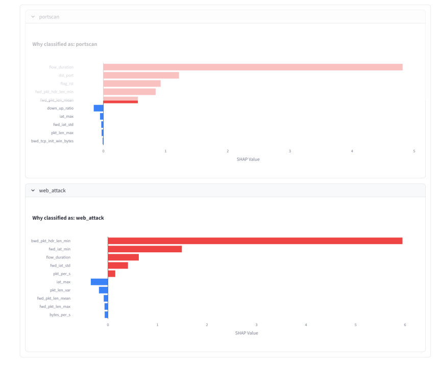

<div align="center">

# ActiveFlow NIDS

### ML-based End-to-End Real-Time Network Intrusion Detection System


ActiveFlow streams network-flow records in a simulated real-time environment, classifies them into 7 traffic categories with a trained XGBoost model, and shows live traffic, threats, and system health on a Streamlit dashboard.

</div>

---

## Important Notes

Please read these before exploring the project.

**1. Simulation-based environment.** The existing flow extraction tools (CICFlowMeter and PyFlowMeter) can't reproduce the feature calculations the training data depends on, so live packet sniffing is not supported right now. ActiveFlow runs in a simulated real-time environment by replaying pre-processed LycoS-IDS2017 flows. A new Python-based flow extraction tool is planned to reproduce the corrected formulas with real-time streaming. The full root-cause analysis is in [`docs/Research and Outcomes/RCA.md`](./docs/Research%20and%20Outcomes/RCA.md).

**2. v2.0.0 status.** v2.0.0 is a stable release of the current system, but it is not a production-ready NIDS. Further validation, infrastructure work, and architectural extensions are planned for future versions.

**3. Documentation.** This README is a high-level overview. Architecture details, engineering decisions, limitations, challenges, and the root-cause analysis live in the [`docs`](./docs) folder.

---

## Demo



> **Note:** The flickering in the GIF comes from fast-forwarding during video editing.

For the full walkthrough (system startup, flow streaming, real-time inference, dashboard updates, and attack detection), watch the [Full Demo Video](https://drive.google.com/file/d/1GWsy5XaC6BbcAw1dAlxZe_rpJutY0UsU/view?usp=sharing).




---

## What It Does

- **Ingests network flows** from a simulation engine that replays LycoS-IDS2017 PCAP-derived CSV records at roughly 1000 flows/sec.
- **Classifies each flow** as Benign, DoS, DDoS, PortScan, Brute Force, Web Attack, or Bots. Model inference takes under a millisecond and runs behind an asynchronous FastAPI server.
- **Streams predictions** to a real-time Streamlit dashboard that shows threat counts, network health, attack trends, system health trends, a live alert panel, and IP geolocation.
- **Uses LycoS-IDS2017** as the main benchmark. It is a corrected version of CIC-IDS2017 that fixes the dataset quality issues documented in the literature cited below.
- **Tracks experiments** with MLflow and DagsHub, including training runs, hyperparameters, and evaluation metrics.

---

## Architecture

.png)

Detailed diagrams and explanations of both the inference and training pipelines are in [`docs/Architecture`](./docs/Architecture/).

---

## Model Performance

ActiveFlow was trained on about **1.8M LycoS-IDS2017 network flows across 7 classes**.

Moving from CIC-IDS2017 to LycoS-IDS2017 fixed the train/serve skew that made confirmed DDoS and PortScan traffic show up as BENIGN during live testing.

| Metric | CIC-IDS2017 (Previous) | LycoS-IDS2017 (Current) |
|---|:---:|:---:|
| F1 Score (Test) | 0.9402 | **0.9999 (Weighted)** |
| Weighted Precision | 0.9029 | **0.9999** |
| Recall | 0.9990 | **0.9999** |
| False Positive Rate | N/A | **0.000069** |
| Train/Test Gap | 0.0596 | **~0.0000** |
| Training Time | 3h 10m | **49 min** |
| Best Model | LightGBM | **XGBoost** |

> **On FPR:** A false-positive rate of 0.000069 works out to roughly 1 false alarm per 14,500 benign flows under the reported evaluation conditions.

### Interpreting the Near-Perfect Metrics

The numbers above are **reported benchmark results, not proof that the model generalizes**.

Preliminary SHAP analysis gives some extra evidence that the model uses **different feature-contribution patterns for different attack classes** instead of leaning on one dominant feature. For example, the explanations for PortScan, DDoS, and Web Attack show clearly different top features.

That said, **SHAP can't validate the evaluation methodology, and it can't rule out data leakage, duplicate or near-duplicate contamination, dataset-specific artifacts, or shortcut learning**. Treat the SHAP results as supporting evidence about model behavior, not as proof that the near-perfect metrics hold up everywhere.

A deeper model audit is planned for **v2.0.1**. It will cover feature-distribution analysis, dominant-feature investigation, ablation experiments, and stronger leakage and generalization checks.

### Per-Class Detection

| Attack Class | Recall |
|---|:---:|
| Benign | 0.9999 |
| DDoS | 1.0000 |
| PortScan | 0.9999 |
| DoS Hulk | 0.9999 |
| Brute Force | 1.0000 |
| Web Attack | 1.0000 |
| Bots | 1.0000 |

---

## SHAP Explainability

The inference pipeline includes **SHAP-based local explainability**, using `TreeExplainer` on the XGBoost model.

For each flow, SHAP values are generated for all model classes, and the inference layer pulls out the attribution vector for the **predicted class**. The model uses 28 selected features, so every flow gets **28 feature-level SHAP contributions**.

The flow looks like this:

```text
Flow
  ↓
28 model features
  ↓
XGBoost multiclass prediction
  ↓
SHAP values for 7 classes
  ↓
Select predicted class
  ↓
28 SHAP contributions
  ↓
Top contributing features
```

### What the SHAP Values Mean

For a given predicted class:

- **Positive SHAP value:** the feature pushes the model output toward the predicted class.
- **Negative SHAP value:** the feature pushes the model output away from the predicted class.
- **Larger absolute value:** the feature contributes more to that individual prediction.

These are **model-output attributions**, not percentages or direct probability changes.

### Why SHAP Is Included

SHAP serves two purposes here:

1. **Local interpretability:** seeing which network-flow features influenced a single prediction.
2. **Model auditing:** checking whether certain features keep dominating predictions, which could point to dataset artifacts or shortcut behavior.

So the SHAP integration is also part of the investigation into the unusually strong benchmark metrics. It does **not** establish on its own that those metrics are valid or generalizable.

---

## Tech Stack

| Layer | Tools |
|---|---|
| ML Pipeline | scikit-learn, XGBoost, LightGBM, imbalanced-learn |
| Sampling | RandomUnderSampler + SMOTETomek (hybrid) |
| Validation & Monitoring | Evidently, GeoIP2 |
| Experiment Tracking | MLflow, DagsHub |
| Explainability | SHAP |
| Inference API | FastAPI, Uvicorn |
| Dashboard | Streamlit, Altair, Plotly |
| Data Versioning | DVC |
| Containerization | Docker, Docker Compose |
| Dataset | LycoS-IDS2017 (corrected CIC-IDS2017) |
| Language | Python 3.12 |

---

## Project Structure

```text
ActiveFlow-NIDS/
│
├── Artifacts/                                # Auto-generated pipeline run artifacts (gitignored)
│   ├── data_ingestion/
│   │   ├── feature_store/                    # Master dataset CSV
│   │   └── ingested/                         # Train and test splits
│   ├── data_transformation/
│   │   ├── transformed_object/
│   │   │   └── preprocessor.pkl              # Serialized sklearn preprocessing pipeline
│   │   └── transformed/                      # Transformed train and test numpy arrays
│   ├── data_validation/
│   │   └── drift_report/
│   │       └── report.yaml                   # Evidently data drift report
│   └── model_trainer/
│       └── trained_model/
│           └── model.pkl                     # Trained model artifact
│
├── data_schema/
│   ├── schema.yaml                           # Column names and dtypes for validation
│   └── top_features.yaml                     # Top 28 selected features with dtypes
│
├── docs/                                     # All detailed documentation (recommended read)
│   ├── assets/                               # Screenshots and architecture diagrams
│   ├── Architecture/                         # Detailed pipeline architecture diagrams
│   ├── Research and Outcomes/
│   │   └── RCA.md                            # Full root cause analysis with academic citations
│   ├── Challenges_Faced_and_Solutions.md
│   ├── Future_Updates.md
│   ├── Key_Engineering_Decisions.md
│   └── Limitations.md
│
├── docker/                                   # Dockerfiles for runtime services
│   ├── api/
│   ├── simulation/
│   └── dashboard/
│
├── EDA/
│   └── EDA.ipynb                             # Exploratory data analysis - feature selection and class distribution
│
├── final_model/                              # Production model artifacts loaded by inference API
│   ├── model.pkl                             # Trained XGBoost classifier
│   └── preprocessor.pkl                      # Trained sklearn preprocessing pipeline
│
├── IDS_Pipeline/                             # Full ML training pipeline
│   ├── components/
│   │   ├── data_ingestion.py                 # MD5 integrity check, zip extraction, temporal train/test split
│   │   ├── data_transformation.py            # Custom sklearn transformers, hybrid sampling, feature scaling
│   │   ├── data_validation.py                # Schema validation, Evidently drift detection
│   │   └── model_trainer.py                  # Hyperparameter tuning, MLflow + DagsHub experiment tracking
│   ├── constant/                             # All pipeline constants, label mappings, config values
│   ├── entity/
│   │   ├── artifact_entity.py                # Dataclasses defining pipeline artifact outputs
│   │   └── config_entity.py                  # Dataclasses defining pipeline configuration
│   ├── exception/
│   │   └── exception.py                      # Custom exception class with traceback detail
│   ├── logging/
│   │   └── logger.py                         # Centralized logger - all pipeline stages log here
│   ├── pipeline/
│   │   └── training_pipeline.py              # Orchestrates all training stages end to end
│   └── utils/
│       ├── main_utils/
│       │   └── utils.py                      # Shared utilities like save/load objects, read YAML
│       └── ml_utils/
│           ├── metric/
│           │   └── classification_metric.py  # F1, precision, recall, FPR calculation
│           └── model/
│               └── estimator.py              # NetworkModel - wraps preprocessor and model together
│
├── Inference_Pipeline/                       # Real-time inference and dashboard
│   ├── inference_api.py                      # FastAPI server - receives flows, runs predictions, serves metrics
│   ├── simulation_engine.py                  # Replays LycoS-IDS2017 flows to inference API at ~1000/sec
│   ├── dashboard.py                          # Streamlit live dashboard (auto-refreshes every second)
│   └── simulation_file/                      # LycoS-IDS2017 CSV files (pulled via DVC)
│
├── scrapped_code/                            # LycoSTand source - kept as reference for future tool development
├── raw_data/                                 # Raw zipped dataset (tracked via DVC)
├── logs/                                     # Training pipeline log files
├── docker-compose.yml
├── requirements.txt
└── setup.py
```

---

## How to Run

### Step 1: Clone the Repository

```bash
git clone https://github.com/Priyanshuc26/ActiveFlow-NIDS.git
cd ActiveFlow-NIDS
```

### Step 2: Create a Virtual Environment (Recommended)

```bash
python -m venv venv

# Windows
venv\Scripts\activate

# macOS / Linux
source venv/bin/activate
```

### Step 3: Install Dependencies

```bash
pip install -r requirements.txt
```

### Step 4: Pull Simulation Data via DVC

The LycoS-IDS2017 simulation CSV files are versioned with DVC, so they aren't stored directly in the repository.

```bash
dvc pull
```

> Make sure you have access to the configured DVC remote before running this.

### Step 5: Set Up the MaxMind GeoIP2 Database

The dashboard uses the MaxMind GeoIP2 City database to map IP addresses to locations. Without the database file, geolocation lookups won't work.

1. Create a free account at [MaxMind](https://www.maxmind.com).
2. Download **GeoLite2-City.mmdb**.
3. Place it in the expected project location, or update the configured path in `dashboard.py`.

### Step 6: Start the Inference API

```bash
python Inference_Pipeline/inference_api.py
```

The FastAPI server starts on port `8000`.

### Step 7: Start the Simulation Engine

In a new terminal:

```bash
python Inference_Pipeline/simulation_engine.py
```

The simulation engine replays LycoS-IDS2017 flows to the inference API at roughly 1000 flows/sec.

### Step 8: Open the Dashboard

In a new terminal:

```bash
streamlit run Inference_Pipeline/dashboard.py
```

Then open `http://localhost:8501` in your browser.

### Docker Compose

The repository also includes a multi-container setup for the API, simulation engine, and dashboard. See `docker-compose.yml` and the `docker/` directory for the container definitions.

---

## API Endpoints

| Endpoint | Method | Description |
|---|:---:|---|
| `/` | GET | Health check |
| `/predict` | POST | Classify a single network flow |
| `/metrics` | GET | Live traffic buffer and prediction counts |

---

## Documentation

This README only gives a high-level overview. The detailed technical documentation is in the [`/docs`](./docs) folder.

- **[Challenges Faced and Solutions](./docs/Challenges_Faced_and_Solutions.md):** the major development challenges and how they were solved.
- **[Key Engineering Decisions](./docs/Key_Engineering_Decisions.md):** decisions that affected performance, stability, correctness, and maintainability.
- **[Limitations](./docs/Limitations.md):** the current limitations of the system.
- **[Future Updates](./docs/Future_Updates.md):** the roadmap for planned major and minor updates.

---

## Root Cause Analysis

During live testing, the previous model predicted BENIGN for 100% of observed flows, including confirmed DDoS traffic generating about 45M bytes/sec. The root cause was a **train/serve skew** between CICFlowMeter (Java, used to build the training data) and PyFlowMeter (Python, used for inference). Both tools expose similarly named flow features, but the underlying calculations were not mathematically equivalent.

Further research into CIC-IDS2017 also turned up documented dataset-quality problems in the cited literature. The project was then moved to LycoS-IDS2017, a corrected benchmark, and the train/serve inconsistency was resolved by aligning the training data with the corrected feature definitions used for inference.

### Why LycoSTand Is Not Used for Live Inference

LycoSTand is the C-based tool used to generate LycoS-IDS2017, which made it the obvious choice for live flow extraction, since it would keep the same feature mathematics as the benchmark. Getting it to run turned out to be one of the hardest parts of the project.

LycoSTand depends on legacy Linux IPC mechanisms, including System V semaphores, and was originally validated on Ubuntu 18.04. Every attempt to run it on a modern system ended in semaphore initialization failures (`errno 1`).

Over two days, the following approaches were tried:

- **Windows terminal:** failed at the initial compilation stage.
- **WSL:** failed with the same semaphore-related runtime errors.
- **Virtual machine (Ubuntu, multiple versions):** involved repeated OS installs, configuration changes, kernel and shared-memory tuning, permission escalation, and runtime debugging. The tool compiled but still failed at runtime.
- **Native Ubuntu dual-boot:** a fresh dual-boot setup was configured and tested, including manual partitioning and disabling Secure Boot. The same runtime issue remained.

After running out of practical workarounds in the tested environments, it became clear that the tool's assumptions don't hold on modern systems. The original research paper also lists Ubuntu 18.04 as its development and validation environment.

That experience led to the plan for a **new open-source, Python-based flow extraction tool** that reproduces LycoSTand's corrected formulas and supports real-time streaming. Once it's ready, it should plug straight into the inference API without any changes to the rest of the inference pipeline.

---

## References

1. Lanvin et al., *Errors in the CICIDS2017 dataset and the significant differences in detection performances it makes* (2022)
2. Engelen et al., *Troubleshooting an Intrusion Detection Dataset: the CICIDS2017 Case Study* (2021)
3. Lui et al., *Error Prevalence in NIDS datasets: A Case Study on CIC-IDS-2017 and CSE-CIC-IDS-2018* (2022)
4. D'hooge et al., *Discovering non-metadata contaminant features in intrusion detection datasets* (2021)
5. [LycoS-IDS2017 Official Repository](https://lycos-ids.univ-lemans.fr/)
6. [LycoSTand: A New Feature Extraction Tool (SciTePress)](https://www.scitepress.org/Papers/2022/107740/pdf/index.html)
7. [Network Intrusion Analysis at Scale (InfoSec Writeups)](https://infosecwriteups.com/network-intrusion-analysis-at-scale-733169fc29ff)
8. [CIC-IDS2017 Original Dataset (University of New Brunswick)](https://www.unb.ca/cic/)
9. [Anatomy of a Flawed Dataset (HAL Science)](https://hal.science/hal-03775466v1/document)
10. [Evaluation of CIC-IDS2017 (IEEE)](https://ieeexplore.ieee.org/document/9474286)
11. [Dataset Reliability Analysis (IEEE)](https://ieeexplore.ieee.org/abstract/document/9947235)

---

## License

Licensed under the [Apache License 2.0](LICENSE).

---

<div align="center">

Built with obsession by [Priyanshuc26](https://github.com/Priyanshuc26)

*"Sometimes the wall is where the real work begins."*

</div>
